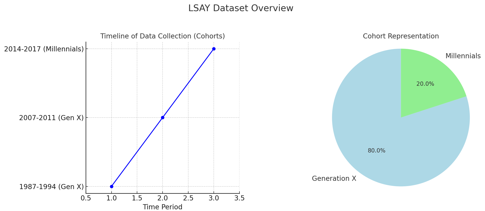
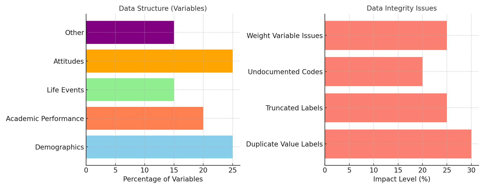
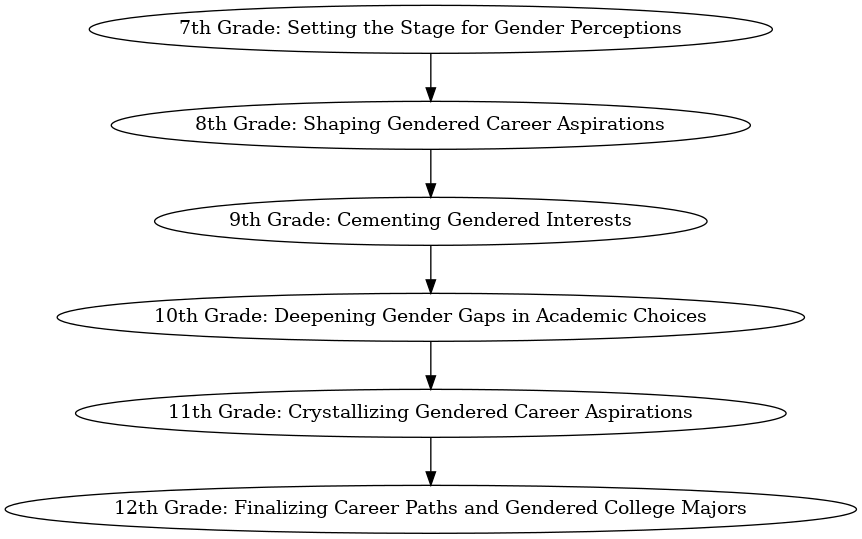

# Gender, Roles & Careers: Exploring Congruity Theories


Understanding how gender roles and perceptions influence career choices and academic paths is crucial for fostering an environment where all students can thrive. By analyzing data from [The Longitudinal Study of American Youth (1987–1994, 2007–2011, 2014–2017)](https://www.icpsr.umich.edu/web/ICPSR/studies/30263), covering 7th, 8th, and 9th grades, we can explore how these early experiences shape students' future aspirations, providing insights into gender congruity theories. This README summarizes key findings from comprehensive analyses across these formative years.

## Project Overview

My code and all results can be found on [GitHub](https://github.com/Ras-hi/ISSR/tree/main/ISSR_Gender_Roles_Career_Rashi_Gupta).
The updated blog can be found on [Medium](https://rashiguptaofficial.medium.com/exploring-gender-roles-in-education-a-grade-wise-analysis-cb87db14bc7d#3e03).
The previous blog for this can also be found on [Medium](https://rashiguptaofficial.medium.com/gender-roles-careers-exploring-congruity-theories-e49e3b8e4797).

## Overall Repository Structure

```bash
ISSR_Gender_Roles_Rashi_Gupta/
│
├── Analysis for 7th grade/
│   ├── 7th_grade_analysis.ipynb
│   ├── 7th_grade_analysis.pdf
│   └── images/
│       
│      
│
├── Analysis for 8th grade/
│   ├── 8th_grade_analysis.ipynb
│   ├── 8th_grade_analysis.pdf
│   └── images/
│     
│      
│
├── Analysis for 9th grade/
│   ├── 9th_grade_analysis.ipynb
│   ├── 9th_grade_analysis.pdf
│   └── images/
│      
│       
│
├── Analysis for 10th grade/
│   ├── 10th_grade_analysis.ipynb
│   ├── 10th_grade_analysis.pdf
│   ├── README.md
│   └── images/
│       ├── 10th_fall_roc_curve.png
│       ├── 10th_spring_roc_curve.png
│       └── 10th_feature_importance.png
│
├── Analysis for 11th grade/
│   ├── 11th_grade_analysis.ipynb
│   ├── 11th_grade_analysis.pdf
│   ├── README.md
│   └── images/
│       ├── 11th_fall_roc_curve.png
│       ├── 11th_spring_roc_curve.png
│       └── 11th_feature_importance.png
│
├── Analysis for 12th grade/
│   ├── 12th_grade_analysis.ipynb
│   ├── 12th_grade_analysis.pdf
│   ├── README.md
│   └── images/
│       ├── 12th_fall_roc_curve.png
│       ├── 12th_spring_roc_curve.png
│       └── 12th_feature_importance.png
│
├── images/
│   ├── gender_distribution.png
│   └── subject_interest_trends.png
│
├── Project_Report/
│   ├── Midterm_Evaluation_PPT.pptx
│   ├── Final_Term_Evaluation_PPT.pptx
│
├── README.md
└── Project_Report.pdf

```
## DATA OVERVIEW 


<p align="center"><em>Figure 1: Cohort Timeline and Representation </em></p>


<p align="center"><em>Figure 1: Variables or Features Di-section </em></p>


## Gender Perceptions

<p align="center"><em>Figure 1: Grade wise gender perceptions  </em></p>

### 7th Grade: Setting the Stage for Gender Perceptions

#### Key Insights:
- **Subject Preferences and Teacher Influence:** Students' enjoyment of subjects like Math, Science, and English, and their perceptions of teacher clarity, show early signs of gendered preferences. Boys tend to lean more towards Math and Science, while girls show a balanced interest across subjects.
- **Parental Expectations and Gender Roles:** Parental expectations and rewards for academic performance vary, often reflecting traditional gender roles. This early reinforcement plays a significant role in shaping students' academic motivations and future goals.

The plot compares how much 7th-grade students like STEM subjects (like math and science) versus Non-STEM subjects (like English and art). It shows that the preferences are spread out and highlights which subjects students generally prefer more.


#### Recommendations:
- **For Educators:** Encourage gender-neutral support in all subjects, emphasizing clarity and enjoyment to foster equal interest in Math and Science among boys and girls.
- **For Parents:** Promote and reward academic achievements uniformly across subjects, regardless of gender, to prevent the reinforcement of traditional gender roles.

### 8th Grade: Shaping Gendered Career Aspirations

#### Key Insights:
- **Career Aspirations and Gender Stereotypes:** Students' first-choice careers in 8th grade often reflect traditional gender roles, with boys leaning towards STEM fields and girls towards humanities and social sciences. These choices are strongly correlated with their future college majors.
- **Grades, Enjoyment, and Gender:** High grades and enjoyment in Math and Science increase the likelihood of boys choosing STEM majors. For girls, enjoyment in these subjects is equally important but often overshadowed by societal expectations.
- **Influence of Gender Perceptions:** Beliefs about gender proficiency in Math and Science show less influence on major choices compared to actual enjoyment and performance in these subjects.


#### Recommendations:
- **For Educators:** Actively counteract gender stereotypes in career counseling, highlighting successful role models from both genders in all fields.
- **For Parents:** Encourage exploration of a wide range of careers, breaking down traditional gender roles and supporting interests in all fields, particularly STEM for girls.

### 9th Grade: Cementing Gendered Interests

#### Key Insights:
- **Subject Preferences and Gender Dynamics:** By 9th grade, students' preferences and perceived teacher clarity in Math, Science, and English reflect entrenched gender roles, with boys showing higher interest in STEM and girls in humanities.
- **Career Utility and Parental Influence:** The perceived career utility of subjects and parental expectations continue to play significant roles, often reinforcing traditional gender roles.
- **Predictive Models and Gender:** Predictive models, such as Random Forest, indicate that gender plays a role in determining college major choices and overall satisfaction, with boys gravitating towards STEM and girls towards humanities and social sciences.

The plot compares how much 9th-grade students like STEM subjects (like math and science) versus Non-STEM subjects (like English and art). It shows that the preferences are spread out and highlights which subjects students generally prefer more.


#### Recommendations:
- **For Educators:** Provide targeted support to break down gender barriers in STEM, ensuring that both boys and girls receive encouragement and resources to pursue their interests.
- **For Parents:** Foster an environment where gender does not dictate career choices, emphasizing the value of all fields and supporting children in pursuing their genuine interests.

## Conclusion: Challenging Gender Congruity Theories

The journey from 7th to 9th grade is a critical period for shaping students' perceptions of gender roles and career aspirations. By understanding and addressing these influences, educators and parents can help dismantle traditional gender stereotypes and support all students in achieving their full potential. Early intervention and continuous support can significantly impact students' long-term satisfaction and success, paving the way for a more equitable and diverse future workforce.


## 10th Grade: Deepening Gender Gaps in Academic Choices
[Further Details](https://github.com/Ras-hi/ISSR/blob/main/ISSR_Gender_Roles_Career_Rashi_Gupta/Analysis%20for%2010th%20grade/Readme.md)
### Key Insights:
- **Subject Preferences and Gender Roles**: By 10th grade, students’ subject preferences and perceived teacher clarity in STEM and non-STEM subjects show more pronounced gender divides. Boys show a higher preference for Math and Science, while girls continue to show more interest in English and Social Studies.
- **Occupational Expectations**: Students' career expectations are becoming more solidified, with boys leaning toward engineering and technology fields, while girls lean toward education, healthcare, and social sciences. This reflects societal gender norms around career choices.
- **Influence of Teacher Perceptions**: Students’ views of teacher clarity in subjects like Math and Science significantly correlate with their interest in pursuing STEM-related college majors. However, gender continues to influence these perceptions, reinforcing traditional stereotypes.


### Recommendations:
- **For Educators**: Facilitate discussions about gender stereotypes in career paths, emphasizing that both boys and girls can excel in STEM and non-STEM fields. Teachers should ensure they present a gender-neutral approach in classrooms.
- **For Parents**: Reinforce the importance of both STEM and humanities fields for both genders. Encourage exploration and open conversations about non-traditional career paths for boys and girls alike.

---

## 11th Grade: Crystallizing Gendered Career Aspirations
[Further Details](https://github.com/Ras-hi/ISSR/blob/main/ISSR_Gender_Roles_Career_Rashi_Gupta/Analysis%20for%2011th%20grade/Readme.md)
### Key Insights:
- **STEM vs Non-STEM Divergence**: Boys' interest in STEM subjects, particularly Math and Science, continues to outpace girls’ interest, while girls show strong preferences for humanities and social sciences. The gap between STEM and non-STEM subject preferences is becoming more entrenched.
- **Role of Enjoyment and Performance**: Enjoyment and academic performance continue to be strong predictors of career choices. However, the influence of societal and parental expectations is more visible at this stage, with students making more conscious career-related decisions based on perceived societal norms.
- **Predictive Models**: Models like Random Forest and XGBoost further highlight how gender plays a role in career outcomes, with boys predominantly predicted to choose STEM fields, while girls lean towards humanities and education.


### Recommendations:
- **For Educators**: Encourage girls to stay engaged with STEM subjects through advanced coursework, internships, and mentorship programs. Boys should also be encouraged to explore non-STEM fields such as the arts and humanities.
- **For Parents**: Support your child’s interests across all fields, regardless of societal expectations. Let them explore STEM or humanities based on their passion and skill, not their gender.

---

## 12th Grade: Finalizing Career Paths and Gendered College Majors
[Further Details](https://github.com/Ras-hi/ISSR/blob/main/ISSR_Gender_Roles_Career_Rashi_Gupta/Analysis%20for%2012th%20grade/Readme.md)
### Key Insights:
- **STEM Major Selection**: As students approach college, those who perform well and enjoy Math and Science are more likely to choose STEM majors. Gender continues to influence major selection, with more boys choosing engineering and technology, while girls lean towards fields like healthcare, education, and social sciences.
- **Impact of Gender Perceptions**: Even though gender perceptions have evolved since the early grades, societal pressures and deeply ingrained stereotypes still influence career aspirations. Boys tend to believe that they are more suited for Math and Science, while girls tend to focus on nurturing careers.
- **Teacher Clarity and Career Decisions**: Students who perceive their teachers as clear and supportive in STEM subjects are more likely to choose STEM careers, though this is stronger for boys than for girls.


### Recommendations:
- **For Educators**: Highlight successful professionals in STEM from diverse genders to inspire students. Encourage all students to explore their full potential in any field they are passionate about.
- **For Parents**: Continue to provide balanced support and encouragement. Challenge traditional gender roles by encouraging both girls and boys to consider all career paths.

---

## Conclusion: Navigating Gendered Perceptions in the Final Years

From 10th to 12th grade, students' academic choices and career aspirations become deeply influenced by both internal motivations and external societal pressures. While academic performance and subject enjoyment play a significant role, gender still affects major decisions, often reinforcing traditional career paths.

By fostering an environment that challenges stereotypes and supports a broad range of interests, educators and parents can help bridge the gender gap in both STEM and non-STEM fields. Continued efforts to provide balanced mentorship, career counseling, and academic support will ensure that both boys and girls are empowered to pursue their true passions, free from the constraints of gendered expectations.


## Acknowledgement

This project is supported by the [Google Summer of Code](https://summerofcode.withgoogle.com/) program and [HumanAI](https://humanai.foundation/). Firstly, I want to thank my mentors, Joan Barth and Erika Steele, who guided me through the whole project. Secondly, I want to thank Dr. Sergie Gleyzer and Andrea Underhill, who provided super helpful suggestions for the project review.
